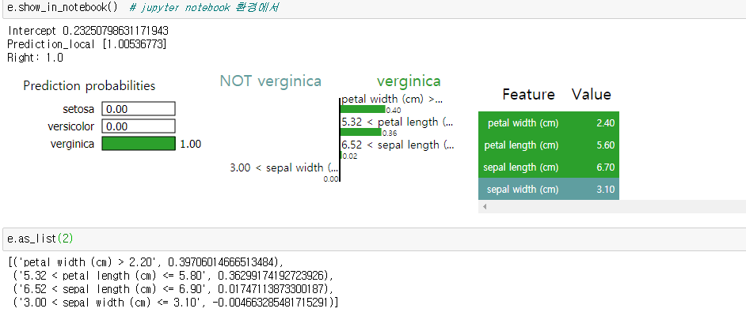
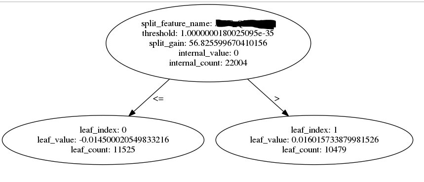
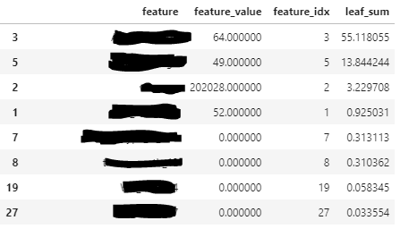

# 목차
1. [Lime이란](#what_is_lime)
1. [Lime 예제](#lime_example)
1. [Lime 파이썬 라이브러리](#lime_py_lib)
1. [Lime 결과 해석](#lime_interpret_result)
1. [Tree-based Local Interpret](#tree_based_local_inter)

# <a name="what_is_lime"> 1. Lime이란 </a>

Local Interpretable Model-Agnostic Explanation의 약어로,
- Model-Agnostic : 모델(알고리즘)이 무엇이든 상관없이
- Local Interpretable : **지역적**으로 해석가능하도록
- Explanation : 설명해주는 방법론

단, binary variable에 특화돼있다.

### 1-1. 지역적의 의미

여기서 말하는 **지역적**의 의미는 다음과 같다.

 <br>
출처 : http://norman3.github.io/prml/docs/chapter01/1.html

기존 Tree 모델의 변수 중요도가 <font color="green">초록색</font> 선에 해당하는 **전역적(global)** 부분에서 X 변수가 얼마나 중요한 지를 설명했다면,<br>
Lime의 변수 중요도는 <font color="red">빨간색</font> 선에 해당하는 **지역적(local)** 부분에서 X 변수가 얼마나 중요한지 를 설명한다.

##### 1-1-1. Iris 데이터

Iris 데이터로 예를 들어보면,

 <br>
출처 : https://pinkwink.kr/1128

<font color="skyblue2">verginica</font>와 <font color="green">versicolor</font>를 분류하기 위해선 petal_length와 petal_width가 둘 다 필수적이지만,<br>
<font color="hotpink">setosa</font>와 나머지를 분류하기 위해선 petal_length와 petal_width 둘 중 하나만 필수적이다.<br>

단순히 변수 중요도만 본다면, petal_length와 petal_width 둘 다 꽤 중요한 변수로 나올 것이고,<br>
그것만 봐서는 <font color="hotpink">setosa</font>를 분류할 때는 petal_length와 petal_width 둘 중 하나만 필요하다는 것은 알 수 없다.

<font color="hotpink">setosa</font>에 국한해서 지역적으로 변수의 중요도를 확인해야만 알 수 있다.

### 1-2. 작동 원리

Lime의 핵심 아이디어<sup>[1](#footnote_1)</sup>는 <font color="red"><b>어떤 지역적 공간에서 입력값을 조금 바꿨을 때 모델(알고리즘)의 예측값이 크게 바뀌면, 그 변수는 중요한 변수로 판단하는 것</b></font>이다.

1. 한 데이터 포인트를 지정하면 N개의 데이터를 추출한다.
1. N개의 데이터로 **지정된 데이터 포인트에 가까울수록 큰 가중치**로 선형회귀 모델을 학습한다. (기본 : Ridge Regression)
1. Ridge Regression의 계수가 큰 변수를 중요한 변수로 간주한다.
  1. https://github.com/marcotcr/lime/issues/475 (내부적으로 scaling)

### 1-3. 필요한 이유

모델(알고리즘)이 뱉는 결과에 대한 이유를 모르면, 해당 모델을 신뢰할 수 없기 때문이다.<br>
가장 널리 알려진 예로 늑대와 허스키를 구분하는 모델(알고리즘)이 있다.

```
늑대와 허스키가 라벨링 된 데이터로 모델(알고리즘)을 정확도가 99% 이상으로 나오게 학습했다.
하지만, LIME으로 분석한 결과,
이미지에 늑대가 포함되어 있는지가 아니라,
이미지에 눈(snow)이 포함됐으면 늑대, 포함되지 않았으면 허스키로 분류했다.

이럴 경우 눈(snow)이 배경인 허스키 이미지를 넣었을 때 제대로 분류하지 못할 가능성이 다분하다.
```

# <a name="lime_example"> 2. Lime 예제 </a>

### 2-1. Iris 데이터
```py
# 임포트
from sklearn.datasets import load_iris
import pandas as pd
import numpy as np
import lime
import lime.lime_tabular
from sklearn.ensemble import RandomForestClassifier

# 데이터 로드
iris = load_iris()
columns = iris["feature_names"] + ["species"]
iris = pd.DataFrame(pd.concat([pd.DataFrame(iris["data"]), pd.DataFrame(iris["target"])], axis=1))
iris.columns = columns

# 모델 학습
rf = RandomForestClassifier()
rf.fit(iris.drop(columns=["species"]), iris["species"])

# Lime Explinaer 인스턴스 생성
explainer = lime.lime_tabular.LimeTabularExplainer(iris.drop(columns=["species"]).values,
                                                   feature_names=iris.drop(columns=["species"]).columns,
                                                   class_names=['setosa', "versicolor", "verginica"],
                                                   verbose=True,
                                                   mode='classification',
                                                   sample_around_instance=True,
                                                   random_state=42,
                                                   discretizer="decile")
# Lime에 데이터 포인트 하나 지정
e = explainer.explain_instance(iris.drop(columns=["species"]).values[140], rf.predict_proba, top_labels=1)
# 분류 문제는 predict_proba, 회귀 문제는 predict 사용
e.show_in_notebook()  # jupyter notebook 환경에서
```
### 2-2. 보스턴 집 가격 예측 (회귀)
https://marcotcr.github.io/lime/tutorials/Using%2Blime%2Bfor%2Bregression.html

### 2-3. 늑대 vs 허스키 (분류)
https://tugot17.github.io/data-science-blog/xai/lime/2020/09/09/LIME-biased-dataset.html

### 2-4. 기타 여러 예제
https://github.com/marcotcr/lime#tutorials-and-api

# <a name="lime_py_lib"> 3. Lime 파이썬 라이브러리 </a>

- Tabular Data -
https://github.com/marcotcr/lime/blob/master/lime/lime_tabular.py 참조
- Text Data -
https://github.com/marcotcr/lime/blob/master/lime/lime_text.py 참조
- Image Data -
https://github.com/marcotcr/lime/blob/master/lime/lime_image.py 참조

### 3-1. Tabular Data 기본 사용법

1. lime.lime_tabular.LimeTabularExplainer 인스턴스 생성
1. 인스턴스의 explain_instance로 일부 데이터 포인트의 지역에 대한 설명
1. explain_instance의 결과로 show_in_notebook로 시각화

### 3-2. 클래스와 함수의 인자 설명

LimeTabularExplainer의 인자
- **training_data** : Lime에 사용할 데이터 셋, 보통 모델(알고리즘) 학습할 때 사용한 train data
- **mode** : "classfication" or "regression"
- training_labels : 잘 모르지만, 필요 없다고 합니다. // *Not required, but may be used by discretizer.*
- **feature_names** : training_data의 변수명, None으로 두면 결과가 숫자로 나와서 해석이 어려움
- **categorical_features** : 범주형 변수의 리스트, 여기 포함되지 않는 변수들은 이산화(discretize) 시킴 / 꼭 값은 int 여야 함. label은 categorical_names에 입력
- **categorical_names** : 범주형 변수의 범주값들이 담긴 리스트, ex) categorical_names["성별"][0] = "남자"
- kernel_width : 공부중입니다... weights를 구할 때 사용 / https://github.com/marcotcr/lime/blob/master/lime/lime_tabular.py#L245
- kernel : 공부중입니다... ... weights를 구할 때 사용/ https://github.com/marcotcr/lime/blob/master/lime/lime_tabular.py#L249
- verbose : True면 explain_instance 함수 호출 시 결과값을 출력함
- **class_names** : classification 시 각 class 이름의 리스트, None으로 두면 결과가 숫자로 나와서 해석이 어려움
- **feature_selection** : explain_instance에서 사용할 변수 선택 방법 / "auto", "lasso_path", "highest_weights", "forward_selection"
  - auto : n_features가 6 이하면 forward_selection, 아니면 highest_weights
  - highest_weights : Ridge를 사용해서 계수가 높은 n_features 개수 만큼 선택
  - forward_selection : 변수를 하나씩 넣어가며, 가장 점수가 높은 변수를 선택해 나가는 방법 / forward, backward, stepwise의 그 forward
  - lasso_path : Least Angle Regression을 사용하는 방법인데, 잘 모르겠습니다.
- **discretize_continuous** : True면 categorical_features에 없는 변수들을 이산화(discretize)시킴
- **discretizer** : 이산화 하는 방법 (quartile, decile, stats, entropy 중 하나), 다른 거 사용하고 싶으면 BaseDiscretizer 상속 받아서 생성
- **sample_around_instance** : True면 N개의 데이터를 뽑을 때, 주어진 데이터 근처에서 뽑고, 그렇지 않으면 각 변수마다 정규분포를 따라서 추출
- **random_state** : random seed
- training_data_stats : trainig_data의 통계값(means, mins, maxs, stds, feature_values, feature_frequencies)이 담긴 사전, None이면 알아서 구함

explain_instance의 인자
- **data_row** : Lime에 넣을 데이터 포인트
- **predict_fn** : 학습된 알고리즘의 predict 함수, N개의 데이터에 대한 예측값을 구하기 위함
  - 보통 모델(알고리즘)의 예측 함수 사용
  - 분류 문제는 predict_proba, 회귀 문제는 predict
- **labels** : 설명될 클래스의 값이 담긴 리스트, 클래스명이 아닌 해당되는 숫자 / classification에 사용
- **top_labels** : class의 개수 중 model_regressor의 값이 높은 상위 n개 / classification에 사용
- **num_features** : model_regressor에서 사용할 변수의 개수 / LimeTabularExplainer의 feature_selection 값에 따라 정하는 방법이 달라짐
- **num_samples** : 몇 개의 데이터를 뽑을 것인지
- distance_metric : weight를 구할 때 사용할 data_row와 num_samples개의 데이터 사이의 거리를 구할 방법
- **model_regressor** : num_samples개의 데이터를 학습할 선형회귀 모델(알고리즘)
- sampling_method : num_samples개의 데이터를 뽑는 방법 / discretizer를 사용하지 않을 때 씀 / "gaussian" or "lhs"
  - gaussian : 평균이 0 표준편차가 1인 정규분포에서 n_samples개 만큼 추출
    - sample_around_instance가 True면 : 위에서 추출한 데이터 * scale + data_row값
    - sample_around_instance가 False면 : 위에서 추출한 데이터 * scale + mean
  - lhs(Latin Hypercube Sampling) : 공부중입니다...


### 3-3. Lime이 진행되는 순서

0. 모델(알고리즘)을 학습
0. 수치형 변수의 값들을 이산화
0. 지정된 데이터 포인트 근처에서 (혹은 전체 데이터셋 중 임의로) N개의 데이터 추출
0. 1.에서 추출된 N개의 데이터에 대해 학습된 모델(알고리즘)으로 예측값 생성
0. 1.에서 추출된 N개의 데이터와 2.에서 생성된 예측값으로 선형회귀 모델(알고리즘) 적합
0. 4.에서 적합된 선형회귀 모델(알고리즘)의 변수별 계수로 지역적 중요도 추출

# 4. <a name="lime_interpret_result"> Lime 결과 해석 </a>

### 4-1. 분류 문제

 <br>
140번 째 데이터를 쓴 결과

- Ridge Regression의 Intercept는 0.235
- Ridge Regression의 예측값은 1.005 (verginica vs not verginica)
- Random Forest Classifier의 예측값은 1.0
- petal width > 2.20이면 petal width <= 2.20일 때보다 verginica일 확률이 0.40 크다.<sup>[2](#footnote_2)</sup>
- 5.32 < petal length <= 5.80이면 그렇지 않을 때보다 verginica일 확률이 0.36 크다.
  - Ridge Regression의 경우 꼭 0~1사이의 값이 아니기 때문에 정확하게는, 확률이 0.4 커진다기보다는 Ridge Regression이 예측하는 값이 0.4 커진다고 해석해야 한다.
- petal_width의 값은 2.40
- sepal_width의 값은 3.10


Random Forest가 setosa를 구분할 때 petal width와 petal length를 둘 다 사용했기 때문에, setosa vs not setosa인 경우에도 RF의 변수 중요도와 큰 차이가 없어서 Lime을 쓰는 실효성이 없지만, 실제로 복잡한 데이터를 사용할 때는 실효성이 있을 수 있다.

### 4-2. 회귀 문제

- 4-1. 분류 문제를 Ridge Regression으로 예를 들어 설명했기 때문에 동일하다.


# 5. <a name="tree_based_local_inter"> Tree-based Local Interpret </a>

# 5-1. LGBM의 경우

대부분의 Tree-based 모델(알고리즘)처럼 LGBM도 내부적으로 N개의 Decision Tree를 생성하게 되고, <br>
각 Decision Tree는 아래와 같은 형태로 저장됨.



참조 : <br>
Boosting Model의 Split Gain - https://towardsdatascience.com/boosting-algorithm-xgboost-4d9ec0207d <br>
LGBM 소스 코드 - https://github.com/microsoft/LightGBM/tree/master/python-package

따라서 각 Decision Tree 마다 / 각 Depth 마다 어떤 변수가 사용됐고, 그 때의 split gain이 얼마인 지 알 수 있다.

해당 정보를 Tabular 형식으로 바꾸면 아래 그림과 같이 나오고,
 <br>
_0, _1, ...는 depth 깊이만큼 생성

최종적으로 각 Decision Tree가 leaf node에서 뱉는 값을 split_gain에 비례해서 Depth마다 사용된 변수에 할당하면, **각 데이터 포인트가 분기된 이력 정보를 가지고 지역적 변수 중요도**를 알 수 있다.

최종 모습은 아래 그림과 같다.



```py
# 예제코드


```


# 6. 참조
- 파이썬 github 페이지 : https://github.com/marcotcr/lime

1. <a name="footnote_1"> https://dreamgonfly.github.io/blog/lime/#%EC%96%B4%EB%96%BB%EA%B2%8C-%EC%9E%91%EB%8F%99%ED%95%98%EB%82%98%EC%9A%94 </a>
2. <a name="footnote_2"> https://github.com/marcotcr/lime/issues/113 </a>
