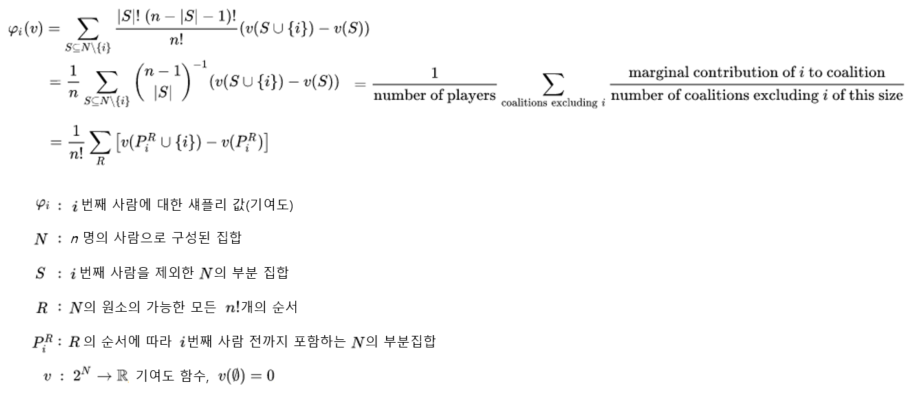
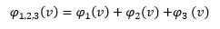
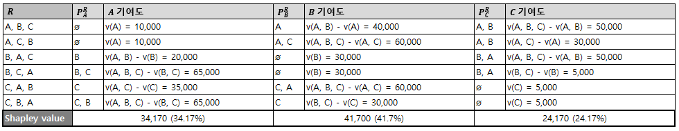
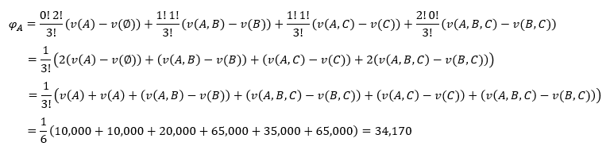
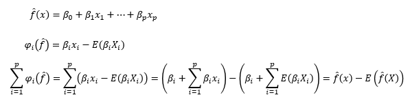
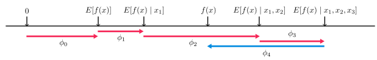

# 0. Index
### [SHAP (SHapley Additive exPlanations)](#1.-SHAP-(SHapley-Additive-exPlanations))
### [Example](#2.-Example)
### [Reference](#3.-Reference)

# 1. SHAP (SHapley Additive exPlanations)

SHAP(SHapley Additive exPlanations)는 섀플리 값(Shapley value)과 피처 간 독립성을 핵심 아이디어로 사용하는 XAI 기법이다.

## 1.1. Shapley values
섀플리 값은 게임 이론에서 처음 등장했는데,
전체 성과를 창출하는데 각 사람이 얼마나 기여했는지를 수치로 표현할 수 있다.
각 사람의 기여도는 그 사람의 기여도를 제외했을 때 전체 성과의 변화 정도로 나타낼 수 있다.

1, 2, 3 조합의 섀플리 값은 각각의 섀플리 값을 더한 값이다.

* ## Example
    >    운송 수단 스타트업에서 합승 제도를 도입하려 한다.
    >    어떻게 하면 사용자들의 합승요금 기여도를 합리적으로 계산하여 요금을 분배할 수 있을까?

    사용자 A, B, C가 홀로 탑승 또는 합승했을 때 지급한 요금 정보

    

    사용자 A, B, C가 특정 순서로 서비스를 이용했을 때 사용자별 기여 요금

    

    사용자 A의 섀플리 값 산출 예시

    

* ## The Shapley value in Detail
    우리는 각 피처가 데이터 포인트의 예측 결과에 어떤 영향을 미치는지에 설명하기 원한다.
    
    > 게임 이론의 전체 성과를 창출하는데 각 사람이 얼마나 기여했는지...
    >> 머신러닝 모델의 예측 결과에 각 피처가 얼마나 기여했는지...
    
    개별 효과를 쉽게 계산할 수 있는 선형 모델로 접근 해보면...

    
    
    기여도는 특정 피처의 효과와 평균 효과의 차이 값이다. 이제 각 피처가 예측 결과에 얼마나 기여했는지 설명할 수 있다.

## 1.2. SHAP (SHapley Additive exPlanations)
SHAP는 모델의 Output을 각 피처의 기여도로 분해한다.

* ## KernelSHAP, TreeSHAP
    Shapley value 추정에 LIME으로부터 착안한 KernelSHAP와 트리기반 모델을 위한 TreeSHAP를 제안했다.
    
    (생략, [Reference](#3.-Reference) - [Interpretable Machine Learning](https://christophm.github.io/interpretable-ml-book/) - [5.10 SHAP](https://christophm.github.io/interpretable-ml-book/shap.html) 참고)

* ## Example
    예시를 통해 다양한 해석 방법을 소개한다.

    > 자궁경부암에 대한 트리 기반 분류 예측 모델에 대한 설명
    
    * ### Force Plot
        * 특정 데이터에 대한 구체적인 설명 시각화
        * 기준선(평균 예측 확률)은 0.066
        * 0.06 낮은 위험도
        : 성병(STDs. number)과 같은 위험 증가 효과는 연령과 같은 감소 효과로 상쇄
        * 0.71 높은 위험도
        : 34년 동안 흡연한 51세 여성은 암에 걸릴 위험이 높음
        

        * 개별 force plot를 세로로 누적한 시각화
        

    * ### Feature Importance
        * Shapley value의 절대값 평균
        * 호르몬약 복용기간이 가장 중요한 피처로 확인
        * SHAP feature importance
                : 피처의 기여도 기반, 계산량이 많아 속도가 느림,
                피처 간 의존성을 고려함,
                음의 영향력을 계산함
            
            Permutation feature importance
                : 모델 성능 감소 기반, 계산 속도가 빠름,
                피처 간 의존성을 고려하지 않음,
                음의 영향력은 계산하지 않음

        

    * ### Summary Plot
        * 호르몬약 복용기간이 짧으면 위험도가 감소하고, 길면 위험도가 증가함
        

    * ### Dependence Plot
        * 하나의 피처가 전체 예측에 미치는 영향력 시각화
        * 호르몬약 복용기간 약 5년까지는 암 위함도가 낮아지나 이후에는 위험도가  높아짐

            

        * dependence plot에 특정 변수의 상호작용 결합

            

* ## Summary
    * SHAP는 섀플리 값을 사용해 피처가 모델에 미치는 영향을 분석하는 XAI기법이다.
    * SHAP는 피처 간 의존성을 고려한다.
    * SHAP는 음의 영향력을 고려한다.
    * SHAP는 하나 이상의 중요한 피처를 시각화할 수 있다.
    * SHAP는 계산량이 많아 속도가 느리다.
    * SHAP는 기존 데이터에 의존적이므로 아웃라이어에 취약하다.

# 2. Example
## 2.1. Predict house prices in suburbs of Boston
https://github.com/slundberg/shap

## 2.2. League of Legends Win Prediction with XGBoost
https://slundberg.github.io/shap/notebooks/League%20of%20Legends%20Win%20Prediction%20with%20XGBoost.html

## 2.3. Census income classification with LightGBM
https://slundberg.github.io/shap/notebooks/tree_explainer/Census%20income%20classification%20with%20LightGBM.html

# 3. Reference

* Book : XAI 설명 가능한 인공지능 인공지능을 해부하다

    

* Definition of Shapley value

    https://en.wikipedia.org/wiki/Shapley_value#Formal_definition

* Interpretable Machine Learning

    https://christophm.github.io/interpretable-ml-book/

* SHAP github

    https://github.com/slundberg/shap
