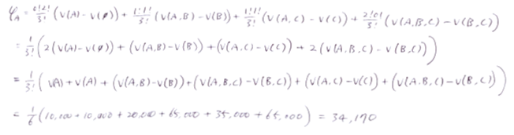
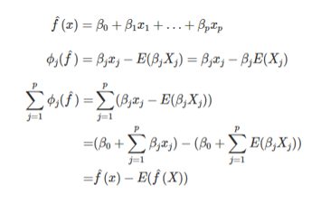

# 0. Index
### [1. SHAP (SHapley Additive exPlanations)](#1.-SHAP-(SHapley-Additive-exPlanations))
### [2. Example](#2.-Example)
### [3. Reference](#3.-Reference)

# 1. SHAP (SHapley Additive exPlanations)
SHAP(SHapley Additive exPlanations)는 섀플리 값(Shapley value)과 피처 간 독립성을 핵심 아이디어로 사용하는 XAI 기법이다.
## 1.1. Shapley value
섀플리 값은 게임 이론에서 처음 등장했는데,
전체 성과를 창출하는데 각 참여자가 얼마나 공헌했는지를 수치로 표현할 수 있다.
각 사람의 기여도는 그 사람의 기여도를 제외했을 때 전체 성과의 변화 정도로 나타낼 수 있다.

### Example
    Uber와 같이 합승 제도를 도입하는 경우,
    어떻게 하면 사용자들의 합승 요금 기여도를 합리적으로 계산할 수 있을까?

### Estimation
정확한 Shapley value를 계산하려면 가능한 모든 피처 집합에 대한 평가(기여도 함수 계산)가 필요하다. 피처가 증가함 따라 가능한 집합의 수가 기하 급수적으로 증가하는 문제에 대해 몬테카를로 샘플링으로 근사치를 제안합니다.(Strumbelj et al. (2014))

### Idea
위 설명에서 기여도를 모델로 대체하고 사람을 피처로 대체하여 생각하면, 
SHAP는 모델의 출력을 각 피처의 기여도로 분해한다.

## 1.2. SHAP (SHapley Additive exPlanations)
SHAP는
1) Shapley value 추정에 local models(LIME)으로부터 착안한 kernel 기반 추정 방식인 KernelSHAP와 트리기반 모델을 위한 효율적인 추정 방식인 TreeSHAP를 제안했다.
2) Shapley Value의 계산 방법을 기반으로 데이터 전체를 해석할 수 있는 많은 방법을 제안했다.

### KernelSHAP, TreeSHAP 설명
(생략)

### Example
    자궁경부암에 대한 트리 기반 분류 예측 모델에 대한 설명
### [Force Plot]
- 특정 데이터에 대한 구체적인 설명 시각화
- 기준선(평균 예측 확률)은 0.066
- 0.06 낮은 위험도
: 성병(STDs. number)과 같은 위험 증가 효과는 연령과 같은 감소 효과로 상쇄

- 0.71 높은 위험도
: 34년 동안 흡연한 51세 여성은 암에 걸릴 위험이 높음

- 개별 force plot를 세로로 누적한 시각화

### [Feature Importance]
- Shapley value의 절대값 평균
- 호르몬약 복용기간이 가장 중요한 피처로 확인
- Permutation feature importance는 모델의 성능 감소 기반, SHAP는 피처의 기여도 기반

### [Summary Plot]
- 호르몬약 복용기간이 짧으면 위험도가 감소하고, 길면 위험도가 증가함

### [Dependence Plot]
- 하나의 피처가 전체 예측에 미치는 영향력 시각화
- 호르몬약 복용기간 약 5년까지는 암 위함도가 낮아지나 이후에는 위험도가  높아짐

- dependence plot에 특정 변수의 상호작용 결합

# 2. Example
## 2.1. Predict house prices in suburbs of Boston
https://github.com/slundberg/shap

## 2.2. League of Legends Win Prediction with XGBoost
https://slundberg.github.io/shap/notebooks/League%20of%20Legends%20Win%20Prediction%20with%20XGBoost.html

## 2.3. Census income classification with LightGBM
https://slundberg.github.io/shap/notebooks/tree_explainer/Census%20income%20classification%20with%20LightGBM.html

# 3. Reference
### - SHAP github : https://github.com/slundberg/shap
### - Interpretable Machine Learning : https://christophm.github.io/interpretable-ml-book/
### - Shapley value definition : https://en.wikipedia.org/wiki/Shapley_value#Formal_definition
### - Book : XAI 설명 가능한 인공지능 인공지능을 해부하다
